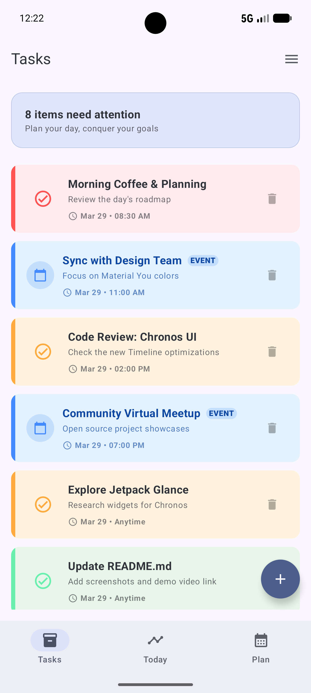
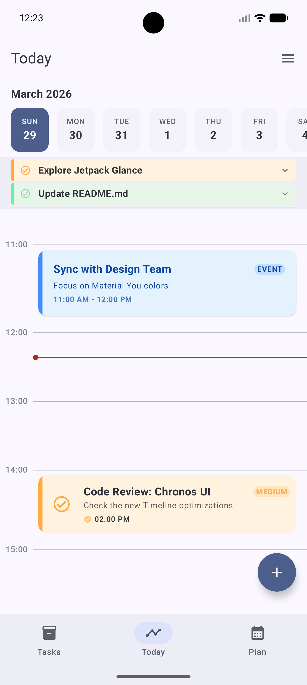
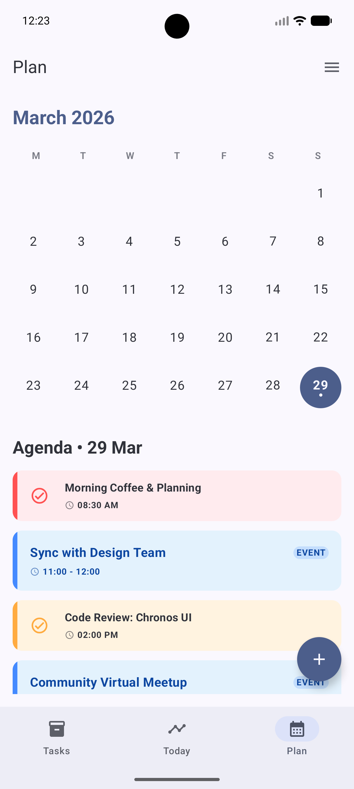
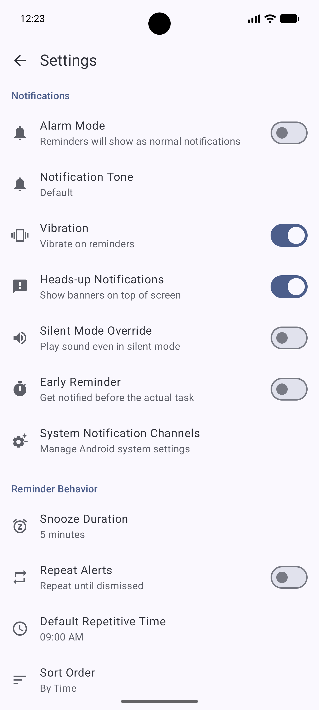
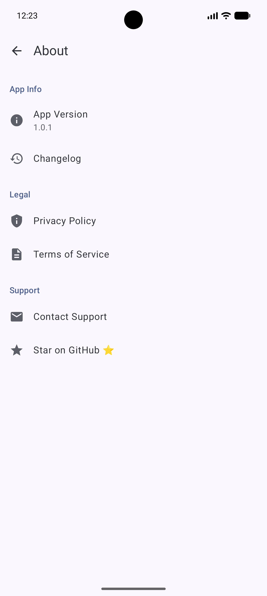

# Chronos ⏳

**Chronos** is a modern, minimalist, and offline-first time management application built with Jetpack Compose. It combines a powerful "Vault" for capturing all your ideas and tasks with a dynamic "Timeline" for planning your day with precision.

[](https://opensource.org/licenses/MIT)


## 📺 Demo Video
Check out Chronos in action:

<a href="https://youtube.com/shorts/AhgHmIloGfM">
  
</a>

## 📸 Screenshots

|                      Tasks (The Vault)                      |                      Today (Timeline)                       |                       Plan (Calendar)                       |
|:-----------------------------------------------------------:|:-----------------------------------------------------------:|:-----------------------------------------------------------:|
|  |  |  |

|                      Settings & Themes                      |                        About Screen                         |
|:-----------------------------------------------------------:|:-----------------------------------------------------------:|
|  |  |

## ✨ Features

- **Timeline View**: A vertical, hour-by-hour breakdown of your day.
- **The Vault**: A central repository for all your tasks, events, and unscheduled ideas.
- **Smart Reminders**: Precise notifications for your tasks and deadlines.
- **Priority System**: Categorize your work into High, Medium, and Low priorities with distinct visual cues.
- **Material You**: Dynamic color support that adapts to your wallpaper (Android 12+).
- **Offline First**: All your data stays on your device. No cloud, no tracking, no account required.
- **Swipe Actions**: Intuitively complete or delete tasks with simple gestures.

## 🛠️ Built With

- **[Kotlin](https://kotlinlang.org/)** - The primary programming language.
- **[Jetpack Compose](https://developer.android.com/jetpack/compose)** - Modern toolkit for building native UI.
- **[Room Database](https://developer.android.com/training/data-storage/room)** - Robust local data persistence.
- **[DataStore](https://developer.android.com/topic/libraries/architecture/datastore)** - Modern replacement for SharedPreferences.
- **[Kotlin Coroutines](https://kotlinlang.org/docs/coroutines-overview.html)** - For asynchronous programming.
- **[Material 3](https://m3.material.io/)** - Google's latest design system.

## 🚀 Getting Started

1. Clone the repository:
   ```bash
   git clone https://github.com/Arnab-cloud/Chronos.git
   ```
2. Open the project in **Android Studio (Iguana or newer)**.
3. Build and run the app on an emulator or a physical device.

## 🤝 Contributing

Chronos is an open-source project and welcomes contributions!
1. Fork the Project.
2. Create your Feature Branch (`git checkout -b feature/AmazingFeature`).
3. Commit your Changes (`git commit -m 'Add some AmazingFeature'`).
4. Push to the Branch (`git push origin feature/AmazingFeature`).
5. Open a Pull Request.

## 📄 License

Distributed under the MIT License. See `LICENSE` for more information.

## 📧 Contact

Arnab Santra - [arnab.santra.cse26@heritageit.edu.in](mailto:arnab.santra.cse26@heritageit.edu.in)

Project Link: [https://github.com/Arnab-cloud/Chronos](https://github.com/Arnab-cloud/Chronos)
